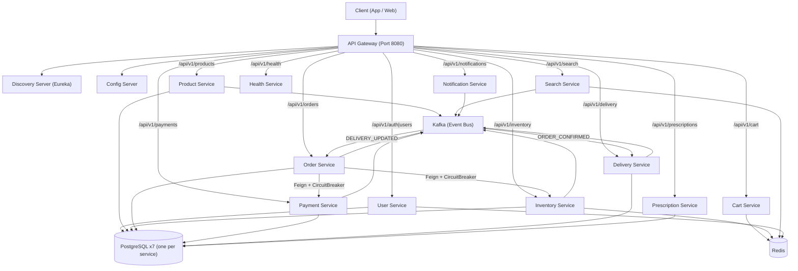
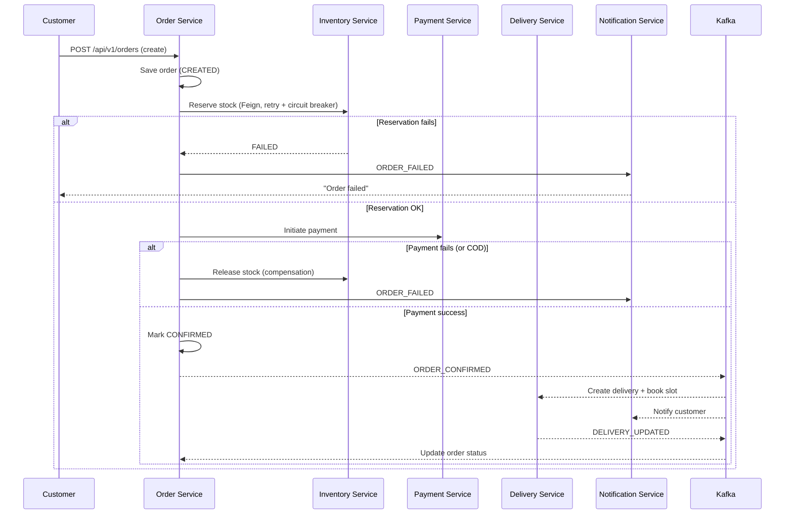
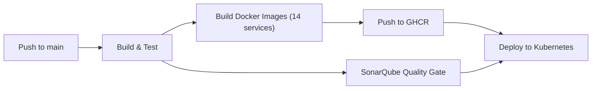

# MediKit

> **An AI-powered Blinkit clone purpose-built for medicine delivery** - a production-ready, highly scalable microservices platform designed to handle **50,000 concurrent users**.

MediKit brings the instant-grocery (Blinkit/Zomato Instant) experience to the healthcare vertical. Browse medicines, upload prescriptions, order with lightning delivery, and track everything in real time - powered by an event-driven microservices architecture.

   

---

## Table of Contents

- [Why MediKit](#why-medikit)
- [Features](#features)
- [System Architecture](#system-architecture)
- [Tech Stack](#tech-stack)
- [Microservices](#microservices)
- [High-Level Design: The Order Saga](#high-level-design-the-order-saga)
- [Phase-wise Development Plan](#phase-wise-development-plan)
- [Scaling to 50,000 Concurrent Users](#scaling-to-50000-concurrent-users)
- [Getting Started](#getting-started)
- [Running Locally (Docker Compose)](#running-locally-docker-compose)
- [Deploying to Kubernetes](#deploying-to-kubernetes)
- [CI/CD Pipeline](#cicd-pipeline)
- [API Overview](#api-overview)
- [Monitoring & Observability](#monitoring--observability)
- [Project Structure](#project-structure)
- [Roadmap](#roadmap)

---

## Why MediKit

Traditional medicine delivery platforms fail on three fronts: **speed**, **inventory accuracy**, and **regulatory compliance** (prescription validation). MediKit is engineered from the ground up to solve all three:

1. **Instant delivery promise** - A delivery slot + real-time tracking system that models pharmacy-to-customer logistics like Blinkit does.
2. **Oversell prevention** - A distributed inventory reservation system with pessimistic locking and saga compensation to guarantee you never sell what you don't have.
3. **Compliance built-in** - A dedicated prescription service that validates prescription uploads before dispatching schedule-H drugs.

---

## Features

### Customer
- Phone/email registration, JWT auth, OTP verification, refresh tokens
- Medicine catalog with categories, trending products, price filters
- Fast search with autocomplete (Redis inverted index, pluggable to Elasticsearch)
- **Generic alternatives** - find cheaper same-salt alternatives
- Persistent shopping cart (Redis-backed, 72h TTL, single-pharmacy enforcement)
- Multiple saved addresses with geolocation
- **Prescription upload & validation workflow**
- Order lifecycle: create → pay → confirm → deliver → complete
- Real-time delivery tracking
- Email/SMS/push notifications
- **AI Health Intelligence** - drug interaction checker, symptom-based recommendations, prescription analysis
### Pharmacy / Admin
- Product & category management
- Inventory/stock management with low-stock alerts
- Delivery slot configuration
- Order management per pharmacy
- Prescription validation queue

### Platform
- API Gateway with JWT security, rate limiting, circuit breaking
- Service discovery (Eureka) & centralized config
- Event-driven integration via Kafka
- Horizontal autoscaling (HPA)
- CI/CD with automated tests, image builds, and deployments

---

## System Architecture



---

## Tech Stack

| Layer | Technology |
|-------|-----------|
| Language / Runtime | Java 17, Spring Boot 3.3 |
| Cloud Frameworks | Spring Cloud (Gateway, Netflix Eureka, Config, OpenFeign), Resilience4j |
| Databases | PostgreSQL 16 (per-service schema), Redis 7 (cache/cart/session/rate-limit) |
| Messaging | Apache Kafka (event bus / saga) |
| Search | Redis inverted index (Elasticsearch-ready abstraction) |
| Containerization | Docker, multi-stage builds, `eclipse-temurin:17-jre-alpine` |
| Orchestration | Kubernetes (Deployments, Services, StatefulSets, HPA, Ingress, PVC) |
| CI/CD | GitHub Actions (build → test → SonarQube → Docker push → kubectl deploy) |
| API Docs | Springdoc OpenAPI 3 / Swagger UI per service |
| Testing | JUnit 5, Mockito |

---

## Microservices

| # | Service | Port | Responsibility | Database |
|---|---------|------|----------------|----------|
| 1 | `api-gateway` | 8080 | Routing, JWT auth, rate limiting, circuit breaking | Redis |
| 2 | `discovery-server` | 8761 | Eureka service registry | - |
| 3 | `config-server` | 8888 | Centralized config (Git-backed) | - |
| 4 | `user-service` | 8101 | Auth (JWT/OTP), profiles, addresses | medikit_users |
| 5 | `product-service` | 8102 | Catalog, categories, pricing, alternatives | medikit_products |
| 6 | `inventory-service` | 8103 | Stock, reservation, deduction, release | medikit_inventory |
| 7 | `cart-service` | 8104 | Redis shopping cart | Redis |
| 8 | `order-service` | 8105 | Order state machine + saga orchestrator | medikit_orders |
| 9 | `payment-service` | 8106 | Mock gateway, idempotency, capture, refund | medikit_payments |
| 10 | `delivery-service` | 8107 | Slots, partner assignment, tracking | medikit_delivery |
| 11 | `notification-service` | 8108 | Email/SMS/push (mock providers) | - |
| 12 | `prescription-service` | 8109 | Prescription upload/validation/expiry | medikit_prescriptions |
| 13 | `search-service` | 8110 | Redis search index, autocomplete | Redis |
| 14 | `health-service` | 8111 | AI health intelligence: drug interactions, symptom analysis & recommendations | medikit_health |
---

## High-Level Design: The Order Saga

Orders are handled through a **choreographed + orchestrated saga** to keep consistency across services without distributed transactions:



**Resilience mechanisms:**
- Inventory reservations use `@Lock(PESSIMISTIC_WRITE)` to prevent oversell at the DB level
- Order-service calls inventory/payment through Feign wrapped in Resilience4j **retry + circuit breaker**
- A `SagaTimeoutScheduler` periodically compensates stale orders stuck in `CREATED`/`PENDING_PAYMENT`
- Payment service is **idempotent** (Redis lock + unique `merchantRefId`)
- All events publish to Kafka; consumers use at-least-once with Redis dedup where needed

---

## Phase-wise Development Plan

This is a huge project - here is exactly how it is being (and should be) delivered:

### Phase 0 - Foundation (DONE)
- Repository setup, parent POM, module structure
- Docker Compose for infra: PostgreSQL, Redis, Kafka, Elasticsearch, MailHog
- Development conventions (`docs/DEVELOPMENT_GUIDE.md`)

### Phase 1 - Platform Services (DONE)
- `discovery-server` (Eureka) ✅
- `config-server` (Git-backed) ✅
- `api-gateway` (routing + JWT + rate limiting) ✅

### Phase 2 - Catalog & Users (DONE)
- `user-service` - auth/JWT/OTP, profiles, addresses ✅
- `product-service` - catalog, categories, alternatives ✅
- `inventory-service` - stock + reservation ✅
- `search-service` - Redis index + autocomplete ✅

### Phase 3 - Commerce (DONE)
- `cart-service` - Redis cart ✅
- `order-service` - state machine + saga ✅
- `payment-service` - mock gateway + idempotency ✅

### Phase 4 - Delivery & Engagement (DONE)
- `delivery-service` - slots + tracking ✅
- `notification-service` - email/SMS/push ✅
- `prescription-service` - upload/validation ✅

### Phase 5 - Kubernetes & CI/CD (DONE)
- Full K8s manifests (StatefulSets, Deployments, HPA, Ingress, ConfigMaps, Secrets) ✅
- GitHub Actions: test → SonarQube → Docker → kubectl deploy ✅

### Phase 6 - Hardening for 50K Concurrent Users (IN PROGRESS)
- [x] Kafka multi-partition tuning + consumer groups per service
- [x] Redis Cluster mode (cart/lock/session sharding)
- [x] PostgreSQL read replicas + connection pooling (PgBouncer)
- [x] Introduce real Elasticsearch for full-text search
- [x] End-to-end load testing (k6/Gatling), capacity model per service
- [x] Observability: Prometheus + Grafana dashboards, distributed tracing (Micrometer Tracing + Tempo), Loki logs
- [ ] Envoy/Istio service mesh, mTLS
- [ ] Chaos engineering (Chaos Mesh) for saga resilience validation
- [x] Kubernetes: PodDisruptionBudgets, NetworkPolicies, priority classes
- [x] Rate limiting at gateway with token-bucket per user + per IP
- [x] Caching strategy: product catalog TTL cache, hot product local cache (Caffeine)

### Phase 7 - Production Compliance (DONE)
- [x] Real payment gateway integration (Razorpay/Stripe)
- [x] Real SMS/email providers (Twilio, SES)
- [x] S3-compatible storage for prescription images
- [x] Pharmacist verification, Drug license validation
- [x] GDPR/HIPAA-style audit logging, data retention policies
- [x] Disaster recovery: cross-region replication, RPO/RTO targets

### Phase 8 - AI Health Intelligence (IN PROGRESS)
- [x] **Drug interaction checker** - `health-service` with a seeded interaction KB (salt pairs, severity, clinical advice); resolves brand names to salts, flags contraindicated/major interactions
- [x] **Symptom-based medicine recommender** - rule-based symptom → condition → medicine reasoning engine with ranked suggestions + safety disclaimers
- [ ] **Prescription OCR & AI validation** - extract drug names from prescription uploads, cross-check against order items and the interaction KB
- [ ] **AI assistant chat API** - compose symptom analysis + interaction checks + prescription findings into a plain-English clinical summary (env-gated LLM backend, rule-based default)

---

## Scaling to 50,000 Concurrent Users

The architecture is designed for this from day one. Here is the strategy:

### Capacity Model (per service, at 50K concurrent users)
Assumes ~2,000 requests/sec ingress, ~500 orders/sec peak:

| Service | Est. TPS | Replicas (HPA) | Bottleneck | Mitigation |
|---------|----------|----------------|------------|------------|
| api-gateway | 2,000 | 10-20 | CPU | Stateless, scales horizontally |
| user-service | 400 | 3-30 | DB writes | Indexed lookups, Redis fail counters |
| product-service | 1,200 | 3-30 | DB reads | Redis cache (3600s TTL) |
| inventory-service | 700 | 3-20 | DB row locks | PESSIMISTIC_WRITE, short txns, Redis locks |
| cart-service | 600 | 3-20 | Redis ops | Redis single ops, per-user locks |
| order-service | 500 | 3-20 | Saga orchestration | Async Kafka, retries, timeouts |
| payment-service | 500 | 2-15 | Idempotency | Redis idempotency keys |
| search-service | 800 | 2-10 | Redis set ops | Inverted index, token sets |
| health-service | 100 | 2-8 | KB lookups | Indexed pairs, pre-resolved salts, condition cache |

### Key Scalability Decisions
1. **Database per service** - independent scale, no cross-service joins, no shared locks
2. **Event-driven decoupling** - Kafka decouples order from delivery/notification; burst absorption
3. **Stateless services** - all state lives in Redis/PostgreSQL/Kafka, so any pod can serve any request
4. **Horizontal autoscaling** - HPA on CPU + memory with aggressive scale-up, conservative scale-down
5. **Connection pooling** - HikariCP tuned (`maxPoolSize=50`), Redis Lettuce pool
6. **Caching** - product/category data cached in Redis; categories have 2h TTL
7. **Rate limiting** - gateway token bucket per user/IP (Redis-backed)
8. **Circuit breakers** - resilient to downstream failures (inventory/payment)
9. **Batch writes** - Hibernate `order_inserts`, batch_size config on write-heavy services

> **Note on PostgreSQL for 50K users:** For truly production-scale, run PostgreSQL with read replicas (product/search-heavy services) and PgBouncer in front. Partition high-volume tables (`orders`, `order_items`) by time.

---

## Getting Started

### Prerequisites
- JDK 17
- Maven 3.8+
- Docker & Docker Compose
- (Optional) kubectl + a Kubernetes cluster

### 1. Build everything
```bash
# Build all services
mvn clean package

# Build & run tests
mvn test
```

### 2. Start infrastructure
```bash
# Start postgres, redis, kafka, elasticsearch, mailhog
./scripts/dev.sh infra
```

### 3. Start all services
```bash
./scripts/dev.sh all
```

### 4. Access services
- Gateway / API: `http://localhost:8080`
- Eureka dashboard: `http://localhost:8761`
- Config server: `http://localhost:8888`
- Swagger per service: `http://localhost:<port>/swagger-ui.html`
- MailHog (capture emails): `http://localhost:8025`

---

## Running Locally (Docker Compose)

```bash
# Start just infrastructure
docker compose --profile infra up -d

# Start infrastructure + all 14 services (first build may take several minutes)
docker compose --profile all up -d --build

# Tail logs
docker compose logs -f

# Stop everything
docker compose down
```

Database defaults: `medikit` / `medikit`. Each service uses its own database:
`medikit_users`, `medikit_products`, `medikit_inventory`, `medikit_orders`, `medikit_payments`, `medikit_delivery`, `medikit_prescriptions`, `medikit_health`.

---

## Deploying to Kubernetes

```bash
# From a machine with kubectl pointing at your cluster:
./scripts/deploy-k8s.sh full
```

Or manually:
```bash
kubectl apply -f k8s/base/namespace.yaml
kubectl apply -f k8s/base/config/
kubectl apply -f k8s/postgres/ k8s/redis/ k8s/kafka/
kubectl apply -f k8s/deployments/
kubectl apply -f k8s/hpa/
kubectl apply -f k8s/ingress/
```

**Important:** Replace the placeholder secrets in `k8s/base/config/medikit-secrets.yaml` (or use External Secrets / Sealed Secrets) before production. Update the image tag in deployments from `:latest` to your released version in a real deployment.

---

## CI/CD Pipeline

`.github/workflows/ci-cd.yml` implements a full pipeline:



- **Build & Test**: runs on every push/PR (`mvn verify`)
- **SonarQube**: static analysis on main
- **Docker**: multi-arch images built with Buildx + GHCR caching, pushed to `ghcr.io/<owner>/medikit/<service>`
- **Deploy**: applies K8s manifests and waits for rollouts

Required secrets: `KUBE_CONFIG`, `SONAR_TOKEN`, `SONAR_HOST_URL`.

---

## API Overview

| Method | Path | Service | Auth |
|--------|------|---------|------|
| POST | `/api/v1/auth/register` | user | Public |
| POST | `/api/v1/auth/login` | user | Public |
| POST | `/api/v1/auth/otp/verify` | user | Public |
| GET | `/api/v1/users/me` | user | Bearer |
| POST | `/api/v1/users/me/addresses` | user | Bearer |
| GET | `/api/v1/products/search?q=` | product | Public |
| GET | `/api/v1/products/trending` | product | Public |
| GET | `/api/v1/products/{id}/alternatives` | product | Public |
| GET | `/api/v1/search/products?q=` | search | Public |
| GET | `/api/v1/search/suggest?q=` | search | Public |
| GET | `/api/v1/cart` | cart | Bearer |
| POST | `/api/v1/cart/items` | cart | Bearer |
| GET | `/api/v1/inventory/stock` | inventory | Public |
| POST | `/api/v1/orders` | order | Bearer |
| GET | `/api/v1/orders/{orderId}` | order | Bearer |
| POST | `/api/v1/payments/initiate` | payment | Bearer |
| GET | `/api/v1/delivery/slots` | delivery | Public |
| GET | `/api/v1/delivery/{orderId}` | delivery | Bearer |
| POST | `/api/v1/prescriptions/upload` | prescription | Bearer |
| POST | `/api/v1/prescriptions/{id}/validate` | prescription | Bearer |
| POST | `/api/v1/health/interactions/check` | health | Public |
| GET | `/api/v1/health/interactions` | health | Public |
| POST | `/api/v1/health/symptoms/analyze` | health | Public |
| GET | `/api/v1/health/conditions` | health | Public |

> **AI Health Intelligence** - `POST /api/v1/health/interactions/check` accepts a list of drug names (brands or salts), resolves them to canonical salts, and returns all known interactions with severity (contraindicated / major / moderate / minor) plus clinical advice. `POST /api/v1/health/symptoms/analyze` maps reported symptoms to probable conditions, ranks them by accumulated confidence, and recommends OTC / prescription remedies with safety flags (including urgent-action alerts for red-flag symptoms).

Full interactive docs: each service exposes Swagger UI at `/swagger-ui.html`.

---

## Monitoring & Observability

Every service exposes Spring Actuator at `/actuator`:
- `/actuator/health` - liveness/readiness probes for K8s
- `/actuator/metrics` - JVM, HikariCP, HTTP metrics
- `/actuator/prometheus` - Prometheus scrape endpoint

Suggested stack (Phase 6): Prometheus + Grafana, Micrometer Tracing (OpenTelemetry) + Tempo, Loki + Promtail.

---

## Project Structure

```
medikit/
├── pom.xml                          # Parent POM (dependency management)
├── docker-compose.yml               # Local infra + services
├── services/
│   ├── common/                      # Shared library (errors, events, JWT, topics)
│   ├── discovery-server/
│   ├── config-server/
│   ├── api-gateway/
│   ├── user-service/
│   ├── product-service/
│   ├── inventory-service/
│   ├── cart-service/
│   ├── order-service/
│   ├── payment-service/
│   ├── delivery-service/
│   ├── notification-service/
│   ├── prescription-service/
│   ├── search-service/
│   └── health-service/              # AI health intelligence
├── k8s/                             # Kubernetes manifests
│   ├── base/                        # namespace, configmaps, secrets
│   ├── postgres/ redis/ kafka/ elasticsearch/
│   ├── deployments/                 # Deployment + Service per microservice
│   ├── hpa/                         # Autoscaling per service
│   └── ingress/
├── .github/workflows/ci-cd.yml      # CI/CD pipeline
├── docs/
│   └── DEVELOPMENT_GUIDE.md         # Conventions for contributors
└── scripts/
    ├── dev.sh                       # Local dev helper
    └── deploy-k8s.sh                # K8s deployment helper
```

---

## Roadmap

- [x] Phase 0-5: Platform, catalog, commerce, delivery, K8s, CI/CD
- [ ] Phase 6: Scale hardening for 50K concurrent users (9/11 done; service mesh + chaos engineering remain)
- [x] Real payment providers, SMS/email providers, object storage
- [x] Phase 7: Production compliance (audit, retention, DR, pharmacist verification)
- [ ] Phase 8: AI Health Intelligence (8a drug interaction checker + 8b symptom recommender done; prescription OCR, AI assistant chat pending)
- [ ] Mobile apps (React Native / Flutter) consuming the gateway API
- [ ] Pharmacist dashboard web app

---

## License

[MIT](LICENSE) © Arijit Rana
